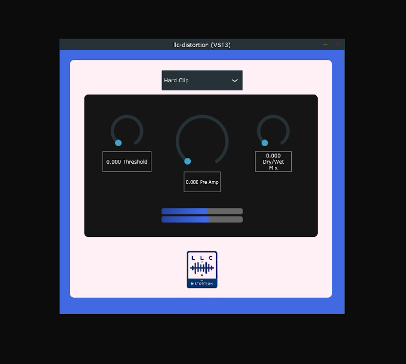

  
## LLC Distortion - A Versatile Distortion VST

LLC Distortion is a versatile effect plugin. It provides a distortion effect, allowing for fine-tuning to control the softness/harshness to suit your needs: add warmth to vocals, add distortion to a guitar, and many more uses. The pre-amp knob allows you to bring out the distortion, giving you control as to how much pre-amplification you need. LLC Distortion has a variety of distortion modes to choose from: Hard Clip, Soft Clip, and Half-Wave Rectification. Add LLC Distortion to anything: vocals, synthesizers, drums, bass, etc. 

 

 
 

Made with the JUCE framework.
  

